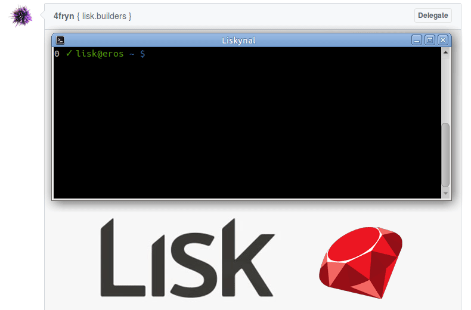

# Lisk.rb

A simple Ruby wrapper for the Lisk API. 💎



## Note before using

This is very early work-in-progress. The idea is to publish this `gem` as soon as it is fully compatible with Lisk Core 1.0.0, which, however, is not released yet. The current implementation of the lisk.rb gem is pure minimal by design and barely allows checking the node status.

API Implemententation Status:

- `Lisk::Legacy` 48/62 APIs for Lisk Core 0.8.0+ ([#4](https://github.com/4fryn/lisk.rb/issues/4))
- `Lisk::Raw` 0/34 APIs for Lisk Core 1.0.0+ ([#1](https://github.com/4fryn/lisk.rb/issues/1))

## Installation

Add this line to your application's Gemfile:

```ruby
gem 'lisk'
```

And then execute:

```bash
$ bundle
```

Or install it yourself as:

```bash
$ gem install lisk
```

## Usage

Make sure to include lisk.rb in your scripts.

```ruby
require 'lisk'
```

To get started, point the lisk.rb to any Lisk-API endpoint. By default, lisk.rb assumes a running Lisk testnet node on localhost port 7000.

```ruby
node = Lisk::Client.new "127.0.0.1", 7000
```

For convenience, check if the Lisk node is connected, fully synchronized, and active by pinging it.

```ruby
if node.is_alive?
  # only do stuff if client is connected, fully synchronized, and active ...
end
```

Get access to the Lisk-0.8.0 legacy API (see [#4](https://github.com/4fryn/lisk.rb/issues/4)).

```ruby
lisk = Lisk::API.new node
```

Get the version of the connected Lisk node.

```ruby
version = lisk.get_version
build = lisk.get_version_build
p "Lisk node version #{version} build #{build}..."
```

Get the status of the connected Lisk node.

```ruby
connected = node.is_alive?
loaded = lisk.is_chain_loaded?
p "Lisk node is connected: #{connected}... Blockchain loaded: #{loaded}..."
```

Figure out if the node is still synchronizing.

```ruby
syncing = lisk.is_syncing?
remaining = lisk.get_remaining_blocks
best = lisk.get_chain_best_block
p "Lisk node is syncing: #{syncing}... #{remaining} remaining blocks to latest block #{best}..."
```

Get some global Lisk blockchain stats.

```ruby
height = lisk.get_best_block
reward = lisk.get_block_reward / 1e8
supply = lisk.get_available_supply / 1e8
p "Lisk chain latest block: #{height}... total supply: #{supply}... block reward: #{reward}"
```

See `examples/*.rb` for more examples implementing the Lisk API.

## Development

After checking out the repo, run `bin/setup` to install dependencies. Then, run `rake spec` to run the tests. You can also run `bin/console` for an interactive prompt that will allow you to experiment.

To install this gem onto your local machine, run `bundle exec rake install`. To release a new version, update the version number in `version.rb`, and then run `bundle exec rake release`, which will create a git tag for the version, push git commits and tags, and push the `.gem` file to [rubygems.org](https://rubygems.org).

## Contributing

Bug reports and pull requests are welcome on GitHub at https://github.com/4fryn/lisk.rb. This project is intended to be a safe, welcoming space for collaboration, and contributors are expected to adhere to the [Contributor Covenant](http://contributor-covenant.org) code of conduct.

## License

The gem is available as open source under the terms of the [MIT License](http://opensource.org/licenses/MIT).

## Code of Conduct

Everyone interacting in the Lisk.rb project’s codebases, issue trackers, chat rooms and mailing lists is expected to follow the [code of conduct](https://github.com/4fryn/lisk.rb/blob/master/CODE_OF_CONDUCT.md).
